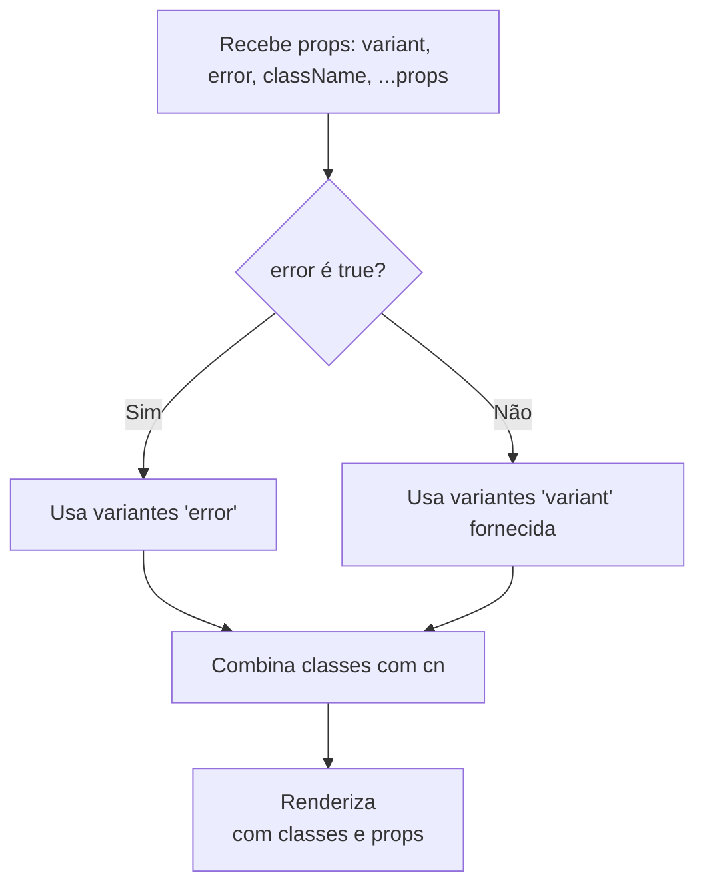

# Documentação do Componente Alert (`alert.tsx`)

O arquivo `alert.tsx` define um componente React reutilizável que exibe mensagens de alerta com diferentes estilos visuais (variações) como padrão, sucesso e erro. Ele utiliza utilitários modernos de estilização para garantir flexibilidade e consistência no design.

---

## ☑️ Objetivo do Componente

O componente **`Alert`** serve para mostrar mensagens de alerta, geralmente para informar o usuário sobre ações, erros ou status de sucesso. Ele permite customização visual através de variantes e pode ser facilmente integrado em outros componentes ou páginas.

---

## 📦 Principais Importações

- `cva` e `VariantProps` do pacote **class-variance-authority**: Gerenciamento das variantes de estilos.
- `HTMLAttributes` do React: Permite que o componente aceite todas as propriedades HTML de uma `<div>`.
- `cn` de `@/utils/class-name-merge`: Função utilitária para unir classes CSS dinamicamente.

---

## 🎨 Estrutura dos Estilos e Variantes

O componente usa a função `cva` para criar diferentes variantes visuais:

```js
const alertVariants = cva('rounded-lg border px-3 py-2 text-sm', {
  variants: {
    variant: {
      default: 'border-disabled/50 bg-disabled/5 text-foreground',
      success: 'border-success text-success bg-success/5',
      error: 'border-error text-error bg-error/5',
    },
  },
  defaultVariants: {
    variant: 'default',
  },
})
```

### 🚦 Tabela de Variantes

| Variante | Classe Extra                                       | Cor/Visual               |
| -------- | -------------------------------------------------- | ------------------------ |
| default  | `border-disabled/50 bg-disabled/5 text-foreground` | Visual padrão, neutro    |
| success  | `border-success text-success bg-success/5`         | Verde, indicando sucesso |
| error    | `border-error text-error bg-error/5`               | Vermelho, indicando erro |

---

## 🧩 Propriedades do Componente Alert

```ts
export type AlertProps = HTMLAttributes<HTMLDivElement> &
  VariantProps<typeof alertVariants> & { error?: boolean }
```

- **Todas as props de HTML `<div>`**: Acessibilidade e flexibilidade.
- **variant**: Visual do alerta (`default`, `success`, `error`).
- **error**: Booleano, força o modo erro, sobrescrevendo a prop `variant`.

---

## ⚙️ Lógica do Componente

```tsx
export function Alert({
  variant,
  error,
  className,
  ...props
}: Readonly<AlertProps>) {
  return (
    <div
      className={cn(
        alertVariants({
          variant: error ? 'error' : variant,
          className,
        }),
      )}
      {...props}
    />
  )
}
```

- Se `error` for true, sempre usa o estilo de erro, ignorando `variant`.
- Junta as classes de estilo via `cn` e aplica ao `<div>`.
- Repassa todas as demais props para o `<div>`, mantendo acessibilidade e flexibilidade.

---

### 📝 Exemplo de Uso

```tsx
<Alert>Mensagem de informação padrão</Alert>
<Alert variant="success">Ação realizada com sucesso!</Alert>
<Alert variant="error">Ocorreu um erro!</Alert>
<Alert error>Erro crítico detectado!</Alert>
```

---

## 🏗️ Diagrama de Fluxo do Componente

O fluxo de decisão do componente pode ser visualizado abaixo:



---

## 🔍 Pontos-Chave

- **Reusabilidade**: O componente pode ser utilizado em qualquer lugar do aplicativo.
- **Personalização**: Aceita variantes e sobrescrita de estilos.
- **Acessibilidade**: Passa todas props de `<div>`, facilitando integração com testes e ferramentas de acessibilidade.
- **Consistência visual**: Usa padrões centralizados de estilização.

---

## 📋 Resumo das Props

| Prop        | Tipo                                    | Descrição                               |
| ----------- | --------------------------------------- | --------------------------------------- |
| `variant`   | `"default"` \| `"success"` \| `"error"` | Define o visual do alerta.              |
| `error`     | `boolean`                               | Se `true`, força o visual de erro.      |
| `className` | `string`                                | Permite adicionar classes extras.       |
| `...props`  | `HTMLAttributes<HTMLDivElement>`        | Outras props HTML válidas para `<div>`. |

---

## 💡 Vantagens

- Centraliza estilização de alertas.
- Fácil de manter e ampliar.
- Funciona como componente controlado ou desacoplado (autônomo).

---

## 🔗 Dependências

Este componente depende de alguns utilitários externos. Para instalar o pacote **class-variance-authority** (caso não esteja presente):

```packagemanagers
{
    "commands": {
        "npm": "npm install class-variance-authority",
        "yarn": "yarn add class-variance-authority",
        "pnpm": "pnpm add class-variance-authority",
        "bun": "bun add class-variance-authority"
    }
}
```

---

## 🛠️ Resumo

O componente `Alert` é uma solução elegante e moderna para exibição de mensagens de alerta, adaptando-se facilmente às necessidades visuais do seu projeto e garantindo consistência na comunicação com o usuário.
