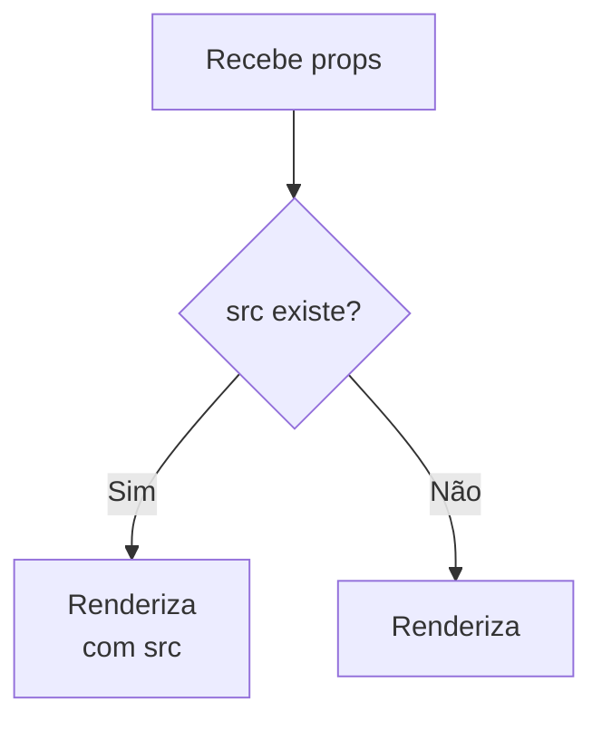

# Documentação do Componente `Avatar` (`avatar.tsx`)

O componente `Avatar` é responsável por exibir a foto de perfil de um usuário, podendo mostrar uma imagem personalizada ou um ícone padrão caso não haja imagem disponível. Ele é bastante utilizado em interfaces de usuário modernas para representar pessoas, perfis ou autores de conteúdo.

---

## Objetivo do Componente

O componente `Avatar` permite exibir, de forma elegante e consistente, a imagem do usuário (ou um ícone de usuário genérico). Ele aceita propriedades para customizar seu comportamento e aparência.

---

## Estrutura do Código

Veja abaixo um resumo do código principal do componente:

```tsx
import { User2Icon } from 'lucide-react'
import Image, { type ImageProps } from 'next/image'
import type React from 'react'
import { cn } from '@/utils/class-name-merge'

interface AvatarProps extends React.ComponentProps<'div'> {
  src?: ImageProps['src'] | null
}

export function Avatar({ src, className, ...props }: Readonly<AvatarProps>) {
  return (
    <div
      className={cn(
        'text-foreground-soft bg-background flex size-10 shrink-0 items-center justify-center overflow-hidden rounded-full [&_svg]:size-5',
        !src && 'border-border border',
        className,
      )}
      {...props}
    >
      {src ? (
        <Image
          alt=''
          src={src}
          height={144}
          width={144}
          className='size-full object-cover'
        />
      ) : (
        <User2Icon />
      )}
    </div>
  )
}
```

---

## Propriedades Aceitas

| Propriedade | Tipo                          | Descrição                                                                         |
| ----------- | ----------------------------- | --------------------------------------------------------------------------------- |
| `src`       | `ImageProps['src'] \| null`   | Fonte da imagem do avatar. Se não for fornecida, exibe o ícone padrão de usuário. |
| `className` | `string`                      | Classes CSS extras para customizar o estilo do componente.                        |
| `...props`  | `React.ComponentProps<'div'>` | Outras propriedades válidas para um elemento `<div>` do React.                    |

---

## Funcionamento

- **Com Imagem:** Se a propriedade `src` for fornecida, o componente exibe a imagem do usuário através do componente `Image` do Next.js. A imagem é ajustada para cobrir todo o espaço disponível e fica com formato circular.
- **Sem Imagem:** Se `src` não for informado ou for `null`, o componente exibe o ícone `User2Icon`, indicando a ausência de uma imagem de usuário.
- **Estilização Responsiva:** O componente utiliza utilitários do TailwindCSS e uma função `cn` para concatenar as classes CSS de maneira eficiente, garantindo um visual consistente. Caso não haja imagem, é adicionado uma borda ao avatar.
- **Acessibilidade:** O elemento `Image` recebe o atributo `alt` vazio, pois é considerado decorativo.

---

## Exemplo de Uso

```tsx
<Avatar src="/usuarios/joao.png" className="ring-2 ring-primary" />
<Avatar className="bg-gray-200" />
```

---

## Fluxo de Decisão do Avatar

Abaixo, um fluxograma simples descrevendo a lógica de exibição do componente:



---

## Pontos Importantes

- O componente é **altamente reutilizável** e pode ser empregado em listas, cabeçalhos, cards de usuário, etc.
- Permite **customização fácil** via `className` e propriedades extras da `<div>`.
- Usa componentes modernos (Next.js e Lucide) e boas práticas de composição de classes CSS.
- A ausência de imagem é tratada de forma elegante com um ícone ilustrativo.

---

## Principais Dependências

O componente utiliza algumas bibliotecas e utilitários externos:

| Dependência                | Função                                                           |
| -------------------------- | ---------------------------------------------------------------- |
| `lucide-react`             | Fornece o ícone `User2Icon`, usado como fallback.                |
| `next/image`               | Otimiza carregamento de imagens no Next.js.                      |
| `@/utils/class-name-merge` | Função utilitária para mesclar classes CSS de forma inteligente. |

---

## Instalação das Dependências

Para garantir o funcionamento correto do componente, instale as dependências necessárias:

```packagemanagers
{
    "commands": {
        "npm": "npm install lucide-react next",
        "yarn": "yarn add lucide-react next",
        "pnpm": "pnpm add lucide-react next",
        "bun": "bun add lucide-react next"
    }
}
```

---

## Considerações Finais

O componente `Avatar` é uma solução prática e elegante para exibição de imagens de perfil, mantendo a consistência visual e experiência do usuário mesmo na ausência de dados. Por ser flexível, pode ser adaptado a diversas necessidades e projetos front-end.
