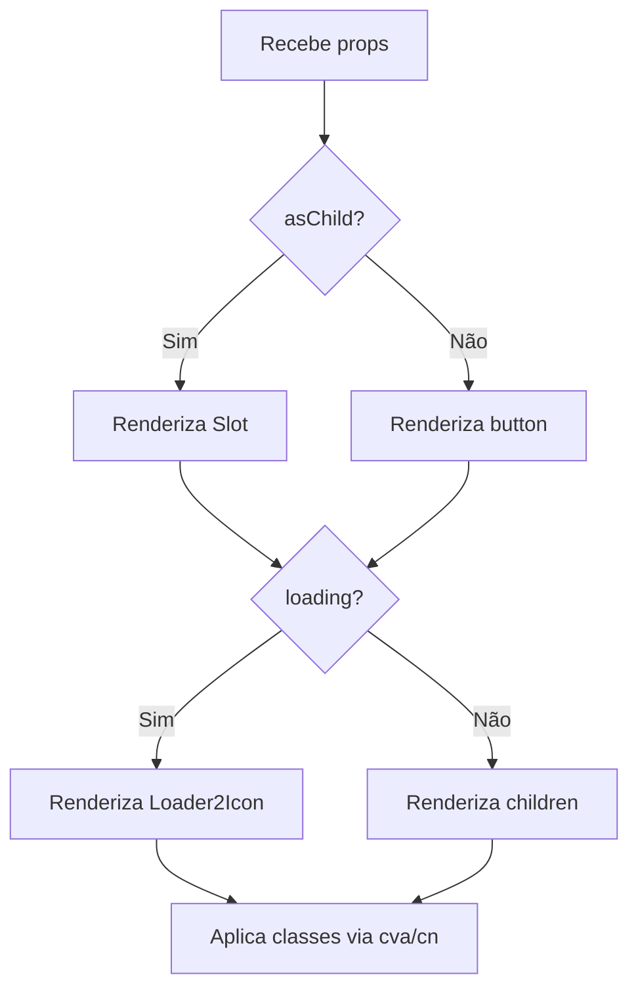

# Documentação do Componente `Button` (`button.tsx`)

Este arquivo implementa um componente de botão altamente customizável em React. Ele oferece múltiplas variantes de estilo, tamanhos, suporte a loading, composição via slot e integração com utilitários modernos de estilização.

---

## 📦 Visão Geral

O componente `Button` serve para criar botões interativos e estilizados de forma consistente em uma aplicação React. Ele oferece:

- Vários estilos predefinidos (variant).
- Diferentes tamanhos.
- Controle de estado de carregamento (`loading`).
- Suporte para composição via `asChild`, permitindo substituir o elemento raiz.
- Integração com utilitários de estilização baseados em Tailwind CSS e Radix UI.

---

## 🏗️ Estrutura do Código

```tsx
import { Slot } from '@radix-ui/react-slot'
import { cva, type VariantProps } from 'class-variance-authority'
import { Loader2Icon } from 'lucide-react'
import { cn } from '@/utils/class-name-merge'

// Definição das variantes de estilo e tamanho do botão
const buttonVariants = cva(
  'ring-offset-background focus-visible:ring-ring inline-flex shrink-0 cursor-pointer items-center justify-center gap-2 rounded-lg text-sm font-medium whitespace-nowrap transition-colors focus-visible:ring-2 focus-visible:ring-offset-2 focus-visible:outline-none disabled:pointer-events-none disabled:opacity-50 [&_svg]:pointer-events-none [&_svg]:shrink-0 [&_svg]:transition-colors',
  {
    variants: {
      variant: {
        default:
          'bg-primary text-primary-foreground hover:bg-primary/80 shadow-xs',
        fancy:
          'bg-primary text-primary-foreground hover:bg-primary/80 inset-shadow-md shadow-xs',
        outline:
          'border-border hover:bg-accent text-accent-foreground bg-background border shadow-xs',
        muted: 'bg-background-soft text-accent-foreground hover:bg-accent',
        ghost: 'text-accent-foreground hover:bg-accent/50 bg-transparent',
      },
      size: {
        default: 'h-10 min-h-10 px-4 [&_svg]:size-5',
        xs: 'h-8 min-h-8 rounded-md px-2.5 text-xs [&_svg]:size-4',
        sm: 'h-9 min-h-9 px-4 [&_svg]:size-4',
        lg: 'h-11 min-h-11 rounded-xl px-3 text-base [&_svg]:size-5',
        icon: 'min-size-10 size-10 [&_svg]:size-5',
      },
    },
    defaultVariants: {
      variant: 'default',
      size: 'default',
    },
  },
)

// Tipagem das propriedades do botão
export interface ButtonProps
  extends React.ButtonHTMLAttributes<HTMLButtonElement>,
    VariantProps<typeof buttonVariants> {
  loading?: boolean
  asChild?: boolean
}

// Implementação do componente Button
function Button({
  className,
  variant,
  size,
  loading,
  disabled,
  asChild = false,
  children,
  ...props
}: Readonly<ButtonProps>) {
  const Comp = asChild ? Slot : 'button'
  return (
    <Comp
      disabled={disabled || loading}
      className={cn(buttonVariants({ variant, size, className }))}
      {...props}
    >
      {loading ? <Loader2Icon className='animate-spin' /> : children}
    </Comp>
  )
}

export { Button, buttonVariants }
```

---

## 🧩 Componentes e Utilitários Importados

| Importação            | Origem                     | Finalidade                                                                            |
| --------------------- | -------------------------- | ------------------------------------------------------------------------------------- |
| `Slot`                | `@radix-ui/react-slot`     | Permite substituir o elemento raiz do botão por qualquer outro (composição avançada). |
| `cva`, `VariantProps` | `class-variance-authority` | Permite criar variantes de estilos condicionais (modificadores de classe).            |
| `Loader2Icon`         | `lucide-react`             | Ícone de loading animado.                                                             |
| `cn`                  | `@/utils/class-name-merge` | Função utilitária para mesclar classes CSS dinamicamente.                             |

---

## 🎨 Variantes de Estilo (`buttonVariants`)

O utilitário `cva` define classes Tailwind CSS dinâmicas para os botões. Veja as variantes disponíveis:

### Variantes de Aparência (`variant`)

| Variant | Descrição                                                | Classes CSS                                                                           |
| ------- | -------------------------------------------------------- | ------------------------------------------------------------------------------------- |
| default | Botão principal, cor de destaque padrão.                 | `bg-primary text-primary-foreground hover:bg-primary/80 shadow-xs`                    |
| fancy   | Igual ao default, mas com sombra interna destacada.      | `bg-primary text-primary-foreground hover:bg-primary/80 inset-shadow-md shadow-xs`    |
| outline | Botão com borda, fundo claro, texto e borda destacados.  | `border-border hover:bg-accent text-accent-foreground bg-background border shadow-xs` |
| muted   | Botão visualmente discreto, fundo suave.                 | `bg-background-soft text-accent-foreground hover:bg-accent`                           |
| ghost   | Botão transparente, só texto, ideal para menos destaque. | `text-accent-foreground hover:bg-accent/50 bg-transparent`                            |

### Variantes de Tamanho (`size`)

| Size    | Descrição                     | Classes CSS                                              |
| ------- | ----------------------------- | -------------------------------------------------------- |
| default | Tamanho padrão                | `h-10 min-h-10 px-4 [&_svg]:size-5`                      |
| xs      | Extra pequeno                 | `h-8 min-h-8 rounded-md px-2.5 text-xs [&_svg]:size-4`   |
| sm      | Pequeno                       | `h-9 min-h-9 px-4 [&_svg]:size-4`                        |
| lg      | Grande                        | `h-11 min-h-11 rounded-xl px-3 text-base [&_svg]:size-5` |
| icon    | Botão só com ícone (quadrado) | `min-size-10 size-10 [&_svg]:size-5`                     |

---

## 🧑‍💻 Propriedades do Componente

| Propriedade | Tipo                                    | Descrição                                                     | Padrão      |
| ----------- | --------------------------------------- | ------------------------------------------------------------- | ----------- |
| `variant`   | `"default" \| "fancy" \| "outline" ...` | Define o estilo visual do botão.                              | `"default"` |
| `size`      | `"default" \| "xs" \| "sm" \| ...`      | Define o tamanho do botão.                                    | `"default"` |
| `loading`   | `boolean`                               | Exibe ícone animado de loading e desabilita o botão.          | `false`     |
| `asChild`   | `boolean`                               | Usa o botão como slot, permitindo substituir o elemento raiz. | `false`     |
| ...         | Qualquer atributo de `<button>` padrão  | Permite uso de eventos, `type`, etc.                          | -           |

---

## ⚙️ Funcionamento Interno

- O componente renderiza um `<button>` ou um elemento customizado (via `Slot`) dependendo do valor de `asChild`.
- Se `loading` for verdadeiro, mostra o ícone animado (`Loader2Icon`) no lugar dos filhos.
- O botão é desabilitado se `loading` ou `disabled` forem verdadeiros.
- Classes CSS são geradas dinamicamente conforme variantes e tamanhos, e podem ser sobrescritas via `className`.
- Ícones SVG dentro do botão herdam estilos especiais para alinhamento e transição.

---

### 📝 Exemplo de Uso

```jsx
import { Button } from './button'

export default function Exemplo() {
  return (
    <>
      <Button>Salvar</Button>
      <Button variant='outline' size='sm'>
        Cancelar
      </Button>
      <Button loading>Carregando...</Button>
    </>
  )
}
```

---

## 🪄 Customização Avançada

### Composição via `asChild`

Permite integrar o botão com outros componentes ou elementos, mantendo o estilo:

```jsx
<Button asChild>
  <a href='/dashboard'>Ir para o Dashboard</a>
</Button>
```

---

## 🧩 Diagrama de Componentização

O fluxo abaixo ilustra a decisão de renderização entre `<button>` e `<Slot>` e a aplicação das variantes:



---

## 🧪 Resumo de Benefícios

- **Flexibilidade:** Múltiplas variantes e tamanhos.
- **Acessibilidade:** Suporte completo a disabled e focus styles.
- **Composição:** Compatível com padrão "asChild" do Radix.
- **UX:** Feedback visual de loading.
- **Customização fácil:** Adapte estilos via classes ou utilitários.

---

## 🧱 Dependências Necessárias

Para funcionar corretamente, estas dependências são essenciais:

```packagemanagers
{
    "commands": {
        "npm": "npm install @radix-ui/react-slot class-variance-authority lucide-react",
        "yarn": "yarn add @radix-ui/react-slot class-variance-authority lucide-react",
        "pnpm": "pnpm add @radix-ui/react-slot class-variance-authority lucide-react",
        "bun": "bun add @radix-ui/react-slot class-variance-authority lucide-react"
    }
}
```

---

## 📚 Conclusão

O componente `Button` deste arquivo é uma solução moderna, flexível e poderosa para botões em aplicações React. Ele facilita a padronização visual e comportamental dos botões, adicionando ainda recursos avançados de composição e feedback de carregamento. Recomendado para projetos que buscam escalabilidade e mantenibilidade no front-end.
