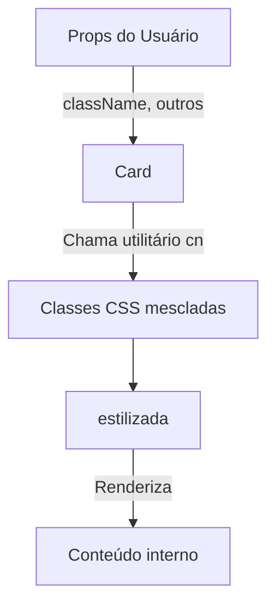

# Documentação Detalhada do Componente `Card` (`card.tsx`)

Este documento descreve o componente `Card` implementado no arquivo `card.tsx`. O objetivo é explicar sua funcionalidade, uso e estrutura interna em detalhes, facilitando sua compreensão e integração em projetos React.

---

## Visão Geral

O componente `Card` é um componente reutilizável de interface de usuário (UI) criado com React e TypeScript. Ele serve como um container estilizado, ideal para agrupar conteúdos ou outros componentes com aparência de "cartão", seguindo padrões de design modernos.

---

## Importações Principais

O arquivo importa dois elementos essenciais:

- **`HTMLAttributes` de 'react'**: Permite que o componente aceite qualquer propriedade padrão de uma `<div>` HTML.
- **`cn` de '@/utils/class-name-merge'`**: Função utilitária para mesclar classes CSS condicionalmente.

```tsx
import type { HTMLAttributes } from 'react'
import { cn } from '@/utils/class-name-merge'
```

---

## Tipagem de Props

O componente define um tipo chamado `CardProps`, que estende as propriedades padrão de uma `<div>`. Isso garante que o componente aceite todas as propriedades HTML esperadas, além de permitir personalizações adicionais via `className`.

```tsx
export type CardProps = HTMLAttributes<HTMLDivElement>
```

**Resumo das Props:**

| Prop      | Tipo                             | Descrição                                |
| --------- | -------------------------------- | ---------------------------------------- |
| className | `string` (opcional)              | Classes CSS extras para personalização   |
| ...props  | `HTMLAttributes<HTMLDivElement>` | Outras props HTML suportadas por `<div>` |

---

## Estrutura do Componente

O componente `Card` é uma função que recebe `className` e outras props. Ele retorna uma `<div>` com estilos pré-definidos e, opcionalmente, classes adicionais fornecidas pelo usuário.

```tsx
export function Card({ className, ...props }: Readonly<CardProps>) {
  return (
    <div
      className={cn(
        'bg-card border-border rounded-2xl border p-4 shadow-xs',
        className,
      )}
      {...props}
    />
  )
}
```

### Estilos Padrão

O componente aplica as seguintes classes CSS por padrão:

- `bg-card`: Define a cor de fundo do cartão.
- `border-border`: Cor da borda do cartão.
- `rounded-2xl`: Bordas arredondadas grandes.
- `border`: Adiciona a borda ao redor do cartão.
- `p-4`: Espaçamento interno (padding) de 1rem (~16px).
- `shadow-xs`: Pequena sombra para dar profundidade.

Se `className` for fornecida, ela é mesclada com as classes padrão usando a função utilitária `cn`.

---

## Utilização do Componente

Você pode usar o componente `Card` para envolver qualquer conteúdo que deseje destacar em um cartão estilizado, mantendo a flexibilidade das props HTML nativas.

### Exemplo de Uso

```tsx
<Card className='mb-4'>
  <h2>Exemplo de Card</h2>
  <p>Conteúdo do cartão vai aqui.</p>
</Card>
```

---

## Fluxo de Dados

O componente recebe propriedades, mescla as classes CSS e renderiza uma `<div>` estilizada. O diagrama abaixo ilustra o fluxo de dados e responsabilidades do componente:



---

## Vantagens ✨

- **Reutilizável**: Pode ser utilizado em diversas partes da aplicação.
- **Personalizável**: Permite adicionar ou sobrescrever estilos via `className`.
- **Acessível**: Aceita todas as props padrão de `<div>`, incluindo eventos e atributos ARIA.
- **Padronização Visual**: Garante consistência visual entre diferentes áreas da aplicação.

---

## Considerações de Projeto

- O componente não impõe restrições ao conteúdo inserido, tornando-o flexível.
- O uso da função `cn` previne conflitos de classes e facilita a composição de estilos.
- Não há lógica de estado interno: o componente é puramente apresentacional.

---

## Resumo Técnico

| Aspecto                 | Valor                                          |
| ----------------------- | ---------------------------------------------- |
| Tipo de Componente      | Funcional, Stateless                           |
| Linguagem               | TypeScript (React)                             |
| Extensibilidade         | Alta (qualquer prop de div pode ser utilizada) |
| Dependências Externas   | Função `cn` para mesclagem de classes CSS      |
| Customização de Estilos | via prop `className`                           |

---

## Perguntas Frequentes

- **Posso inserir qualquer elemento dentro do Card?**  
  Sim, qualquer conteúdo React pode ser filho do Card.

- **Como sobrescrevo os estilos padrão?**  
  Basta passar um `className` personalizado.

---

## Conclusão

O componente `Card` é um bloco fundamental para construir UIs organizadas e visualmente agradáveis, oferecendo uma interface consistente e fácil de personalizar em projetos React modernos.

---

Se precisar de instruções de instalação de dependências, consulte a documentação do utilitário `cn` e garanta que o mesmo esteja presente no caminho `@/utils/class-name-merge`.
