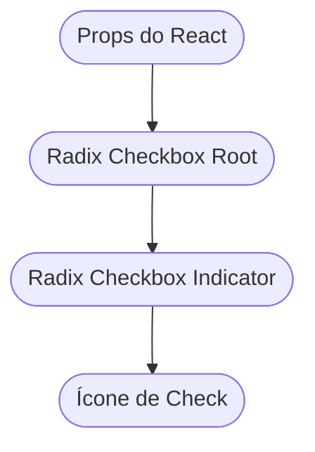

# Checkbox Component (`checkbox.tsx`)

Este arquivo implementa um componente de **Checkbox** reutilizável em React, utilizando a biblioteca Radix UI para acessibilidade e estilização avançada. Ele foi projetado para ser altamente personalizável e integrável em aplicações modernas, especialmente aquelas que utilizam design system ou precisam de consistência visual e comportamental.

---

## Visão Geral

O componente `Checkbox` encapsula um checkbox estilizado, com suporte a dois tamanhos (`sm` e `md`) e estados visuais claros. Ele utiliza o Radix UI como base para acessibilidade, além do ícone `Check` da biblioteca `lucide-react` para indicar seleção.

---

## Objetivos do Componente

- Prover uma caixa de seleção (checkbox) compatível com acessibilidade.
- Permitir customização de tamanho (`sm`, `md`).
- Integrar facilmente com formulários e interfaces customizadas.
- Manter o visual consistente usando utilitários (`cn`) para merge de classes CSS.
- Adicionar feedback visual para estados como selecionado, foco, desabilitado, entre outros.

---

## Importações e Dependências

O componente depende das seguintes bibliotecas:

| Biblioteca                 | Função                                            |
| -------------------------- | ------------------------------------------------- |
| `@radix-ui/react-checkbox` | Lida com a acessibilidade e lógica do checkbox    |
| `lucide-react`             | Fornece o ícone do "check"                        |
| `@/utils/class-name-merge` | Utilitário para mesclar classes CSS dinamicamente |

### Instalação dos Pacotes

```packagemanagers
{
    "commands": {
        "npm": "npm install @radix-ui/react-checkbox lucide-react",
        "yarn": "yarn add @radix-ui/react-checkbox lucide-react",
        "pnpm": "pnpm add @radix-ui/react-checkbox lucide-react",
        "bun": "bun add @radix-ui/react-checkbox lucide-react"
    }
}
```

---

## Propriedades do Componente

| Propriedade | Tipo                                                  | Padrão | Descrição                                                     |
| ----------- | ----------------------------------------------------- | ------ | ------------------------------------------------------------- |
| `size`      | `'sm' \| 'md'`                                        | `'sm'` | Define o tamanho do checkbox e do ícone                       |
| `...props`  | Todos de `CheckboxPrimitive.Root` (herda do Radix UI) | -      | Props adicionais como `checked`, `onChange`, `disabled`, etc. |

---

## Estrutura do Componente

O componente é funcional, baseado em React, e utiliza o padrão props spreading para flexibilidade.

```tsx
import * as CheckboxPrimitive from '@radix-ui/react-checkbox'
import { Check } from 'lucide-react'
import { cn } from '@/utils/class-name-merge'

export interface CheckboxProps
  extends React.ComponentProps<typeof CheckboxPrimitive.Root> {
  size?: 'sm' | 'md'
}

export function Checkbox({ size = 'sm', ...props }: Readonly<CheckboxProps>) {
  return (
    <CheckboxPrimitive.Root
      className={cn(
        'peer border-border focus-visible:ring-ring data-[state=checked]:border-primary data-[state=checked]:text-primary-foreground data-[state=checked]:bg-primary data-[state=checked]:inset-shadow-md shrink-0 rounded border-2 shadow-xs focus-visible:ring-2 focus-visible:ring-offset-1 focus-visible:outline-none disabled:cursor-not-allowed disabled:opacity-50',
        size === 'sm' && 'size-4.5',
        size === 'md' && 'size-5',
      )}
      {...props}
    >
      <CheckboxPrimitive.Indicator
        className={cn('flex items-center justify-center')}
      >
        <Check
          className={cn(size === 'sm' && 'size-3', size === 'md' && 'size-4')}
          strokeWidth={3}
        />
      </CheckboxPrimitive.Indicator>
    </CheckboxPrimitive.Root>
  )
}
```

---

## Como Utilizar

### Exemplo Básico

```tsx
<Checkbox checked={checked} onCheckedChange={setChecked} size='md' />
```

### Com Formulários

```tsx
<form>
  <label>
    <Checkbox
      size='sm'
      checked={termosAceitos}
      onCheckedChange={setTermosAceitos}
    />
    Aceito os termos de uso
  </label>
</form>
```

---

## Detalhes das Classes CSS Utilizadas

O componente utiliza tailwind utility classes e data attributes para:

- Alterar borda, cor de fundo e sombra quando selecionado (`data-[state=checked]:*`)
- Exibir diferentes tamanhos do checkbox e do ícone (`size-4.5`, `size-5`, `size-3`, `size-4`)
- Adicionar foco visível e sombra ao receber foco (`focus-visible:ring-*`)
- Exibir estado desabilitado com opacidade e cursor (`disabled:*`)

### Tabela de Estilos por Estado

| Estado                 | Classe CSS Aplicada                                           |
| ---------------------- | ------------------------------------------------------------- |
| Selecionado            | `border-primary`<br>`bg-primary`<br>`text-primary-foreground` |
| Foco                   | `focus-visible:ring-2`<br>`focus-visible:ring-ring`           |
| Desabilitado           | `disabled:cursor-not-allowed`<br>`disabled:opacity-50`        |
| Tamanho Pequeno (`sm`) | `size-4.5` (root), `size-3` (ícone)                           |
| Tamanho Médio (`md`)   | `size-5` (root), `size-4` (ícone)                             |

---

## Fluxo de Dados e Interação

O fluxo de dados do componente é direto: as props controlam o estado, enquanto o Radix UI gerencia o foco, acessibilidade e eventos nativos do checkbox.

### Diagrama de Fluxo do Componente



---

## Vantagens e Boas Práticas

- ✅ **Acessibilidade**: Uso do Radix UI garante navegação por teclado e compatibilidade com leitores de tela.
- ✅ **Customização**: Fácil alterar tamanho e classe CSS via props.
- ✅ **Reutilizável**: Pode ser usado em múltiplos contextos, inclusive formulários complexos.
- ✅ **Visual consistente**: Mantém padrão visual mesmo com diferentes estados e tamanhos.

---

## Quando Usar Este Componente

- Listas de seleção em formulários.
- Preferências de usuário.
- Seleção de múltiplos itens.
- Qualquer interface que exija feedback visual claro de seleção.

---

## Resumo

O componente `Checkbox` é uma solução moderna, acessível e estilizada para caixas de seleção em aplicações React. Ele utiliza o Radix UI para lógica e acessibilidade, além de oferecer customização visual para integração com design systems robustos.
