# Documentação do Componente Input (`input.tsx`)

O arquivo `input.tsx` define um componente React reutilizável que exibe campos de entrada de texto com suporte a ícones e diferentes variantes visuais, como padrão e erro. Ele utiliza utilitários modernos de estilização para garantir flexibilidade e consistência no design.

---

## ☑️ Objetivo do Componente

- O componente **`Input`** serve para capturar entradas de texto do usuário.
- Permite personalização visual através de variantes e tamanhos.
- Pode opcionalmente exibir um ícone dentro do campo, melhorando a experiência do usuário.

---

## 📦 Principais Importações

- `cva` e `VariantProps` do pacote **class-variance-authority**: Gerenciamento das variantes de estilos.
- `LucideIcon` do pacote **lucide-react**: Para renderização opcional de ícones.
- `cn` de `@/utils/class-name-merge`: Função utilitária para unir classes CSS dinamicamente.

---

## 🎨 Estrutura dos Estilos e Variantes

- O componente usa a função `cva` para criar diferentes variantes visuais:

```tsx
export const inputVariants = cva(
  'ring-offset-background focus-visible:ring-ring bg-background h-10 w-full shrink-0 rounded-lg border px-3 text-sm shadow-xs transition-colors focus-visible:ring-2 focus-visible:ring-offset-2 focus-visible:outline-none disabled:cursor-not-allowed disabled:opacity-50',
  {
    variants: {
      variant: {
        default: 'border-border text-foreground placeholder:text-disabled',
        error: 'border-error text-error focus-visible:ring-error',
      },
      size: {
        default: 'h-10',
        sm: 'h-9',
      },
    },
    defaultVariants: {
      variant: 'default',
      size: 'default',
    },
  },
)
```

### 🚦 Tabela de Variantes

- `default`: `border-border text-foreground placeholder:text-disabled` (Visual padrão, neutro)
- `error`: `border-error text-error focus-visible:ring-error` (Indica erro)

### 📏 Tabela de Tamanhos

- `default`: `h-10`
- `sm`: `h-9`

---

## 🧩 Propriedades do Componente Input

```tsx
export type InputProps = Omit<
  React.InputHTMLAttributes<HTMLInputElement>,
  'size'
> &
  VariantProps<typeof inputVariants> & {
    icon?: LucideIcon
  }
```

- Todas as props de HTML `<input>`: acessibilidade e flexibilidade.
- `variant`: Visual do input (`default`, `error`).
- `size`: Altura do input (`default`, `sm`).
- `icon`: Componente de ícone opcional a ser exibido dentro do campo.

---

## ⚙️ Lógica do Componente

```tsx
export function Input({
  icon,
  className,
  variant,
  size,
  ...props
}: Readonly<InputProps>) {
  const Icon = icon

  const iconColors = {
    default: 'text-disabled',
    error: 'text-error',
  }

  if (Icon) {
    return (
      <div
        className={cn(
          'relative flex w-full items-center [&>svg]:size-4.5',
          props.disabled && '[&>svg]:opacity-50',
        )}
      >
        <input
          type={props.type ?? 'text'}
          className={cn(inputVariants({ variant, size, className }), 'pl-10')}
          {...props}
        />
        <Icon
          data-testid='input-icon'
          className={cn(
            'pointer-events-none absolute left-3 shrink-0 transition-colors',
            iconColors[variant ?? 'default'],
          )}
        />
      </div>
    )
  }

  return (
    <input
      type={props.type ?? 'text'}
      className={cn(inputVariants({ variant, size, className }))}
      {...props}
    />
  )
}
```

- Se `icon` for fornecido, exibe um ícone dentro do input.
- Junta as classes de estilo via `cn` e aplica ao `<input>`.
- Repassa todas as demais props para o `<input>`.

---

### 📝 Exemplo de Uso

- `<Input placeholder="Digite seu nome" />`
- `<Input variant="error" placeholder="Erro no campo" />`
- `<Input icon={SearchIcon} placeholder="Pesquisar..." />`

---

## 🏗️ Diagrama de Fluxo do Componente

```mermaid
flowchart TD
    A[Recebe props: icon, variant, size, className, ...props] --> B{icon fornecido?}
    B -- Sim --> C[Renderiza <div> com <input> e <Icon>]
    B -- Não --> D[Renderiza apenas <input>]
```



---

## 🔍 Pontos-Chave

- Reusabilidade: pode ser usado em qualquer formulário.
- Personalização: suporta variantes de estilo, tamanhos e ícones.
- Acessibilidade: passa todas props de `<input>`.
- Consistência visual: usa padrões centralizados de estilização.

---

## 📋 Resumo das Props

- `variant` (`'default'` | `'error'`): define o visual do input.
- `size` (`'default'` | `'sm'`): define a altura do input.
- `icon` (`LucideIcon`): ícone opcional dentro do campo.
- `className` (`string`): adiciona classes extras.
- `...props` (`InputHTMLAttributes<HTMLInputElement>`): outras props HTML válidas.

---

## 💡 Vantagens

- Flexível e reutilizável.
- Fácil de manter e ampliar.
- Compatível com ícones e variantes de estilo.

---

## 🔗 Dependências

- `class-variance-authority`
- `lucide-react`

Instalação:

```bash
npm install class-variance-authority lucide-react
# ou
yarn add class-variance-authority lucide-react
```

---

## 🛠️ Resumo

- O componente `Input` é uma solução moderna e flexível para campos de entrada em React.
- Permite personalização visual, suporte a ícones e fácil integração em formulários complexos.
